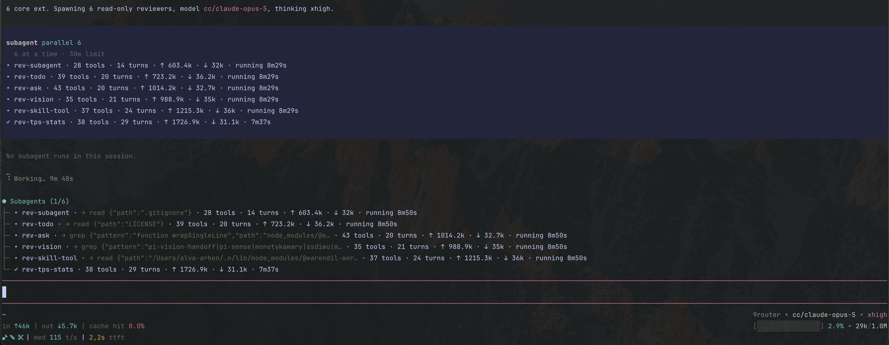

# @arhen/pi-core-subagent

[](https://www.npmjs.com/package/@arhen/pi-core-subagent)
[](./LICENSE)
[](https://github.com/earendil-works/pi)

Minimalist pi extension: **fast in-process subagents** with single / parallel / chain modes, background runs, cancellation, intercom (child↔leader) and an agent↔agent mailbox.

Built for one job: delegate work to isolated subagents **without bloating the parent context**.



*The `subagent` tool call plus the live above-editor widget: per-agent activity, tool counts, turns, token counters and timers.*

## Design principles

- **No agent files, no discovery.** The leader defines every subagent inline per call — name, system prompt, toolset. Nothing is read from or written to disk.
- **Two toolsets only.** Read-only (`read, grep, find, ls` — default) or write (`read, grep, find, ls, bash, edit, write` — `write: true`). No per-agent tool config surface.
- **In-process** — children are `AgentSession`s in the same runtime. No process spawn, no context bleed.
- **Zero parent-context injection.** No catalog, no context hook. 6 slim tools total.
- **Throttled updates** — widget/stream updates coalesce to ~6/s; no per-event deep clones.
- **No silent hangs** — watchdog aborts children that produce no events for 3 minutes.
- **No default runtime cap** — tasks run until done, stalled (watchdog), or aborted by the user. `maxRuntimeMs` is opt-in (default 0 = unlimited).

## Install

```sh
pi install npm:@arhen/pi-core-subagent
# or locally: pi install /path/to/pi-subagents
```

## Usage — the leader invents the agents

Define agents inline per call — never creates or reads agent files. Model resolution: explicit `provider/model-id` (or bare id) via the pi model registry → agent-file `model` → the parent's current model → settings default.

```json
{
  "agent": "api-reviewer",
  "prompt": "You are a strict API reviewer. Check auth, rate limiting, and error handling. Cite file:line.",
  "task": "Review src/api/upload.ts"
}
```

Parallel — mixed toolsets, siblings can talk via mailbox:

```json
{
  "allowIntercom": true,
  "tasks": [
    { "agent": "researcher", "prompt": "You find facts. Cite paths.", "task": "Map the auth flow", "write": false },
    { "agent": "implementer", "prompt": "You make minimal changes.", "task": "Implement POST /api/upload", "write": true }
  ]
}
```

Chain — `{previous}` is replaced with the prior agent's output:

```json
{
  "chain": [
    { "agent": "planner", "prompt": "You write a step list.", "task": "Plan the change", "write": false },
    { "agent": "doer", "prompt": "You follow the plan exactly.", "task": "Execute: {previous}", "write": true }
  ]
}
```

Background + intercom:

```json
{
  "agent": "auditor",
  "prompt": "You audit dependencies.",
  "task": "Audit package.json for outdated deps",
  "background": true,
  "allowIntercom": true
}
```

## Tools

| Tool | Purpose |
|---|---|
| `subagent` | single / `tasks` (parallel) / `chain` (`{previous}`); `background:true` fire-and-forget; `allowIntercom:true` enables child talk tools; `notifyPerTask: true` wakes you as each task completes (default off) |
| `subagent_status` | live per-task snapshot (non-blocking) |
| `subagent_result` | full output of a run or one task |
| `await_subagent` | block until a run finishes (optional `timeoutMs`) |
| `reply_subagent` | answer a child's `ask_parent` question |
| `subagent_cancel` | abort a running/queued run |

### Per-task fields

`agent` (name you invent — required), `task` (required), `prompt` (system prompt, optional — minimal default used), `write` (toolset, default read-only), plus optional `model` (`provider/model-id`), `thinking` (validated enum: `off|minimal|low|medium|high|xhigh|max`), `tools` (explicit allowlist), `cwd`, `maxRuntimeMs`, `id`. Top-level only: `background`, `notifyPerTask`, `allowIntercom`, `concurrency`.

### Child talk tools (when `allowIntercom: true`)

| Tool | Meaning |
|---|---|
| `ask_parent` | blocking question to the leader; parent answers via `reply_subagent` |
| `notify_parent` | one-way message to the leader |
| `send_agent_message` | message to a sibling subagent's mailbox (`to` = its task id, or `"leader"`) |
| `poll_agent_messages` | drain this subagent's mailbox |

## Peek — `/peek` or `ctrl+shift+a`

Read-only pane over the session's subagents:

- `shift+↑`/`shift+↓` (or `j`/`k`) — move between agents; bare arrows work too where the terminal doesn't reserve them
- `enter` — live tail of that child's session file (`esc` goes back)
- `x` then `y` — abort ONE subagent (only mutation; `n`/any other key cancels)
- `esc` — close

## Context budget

- Parent tools: 6 schemas with short descriptions. **No catalog, no context hook** — nothing injected per request.
- Background completion: 3-line notice. Full text only via `subagent_result`.
- Children: isolated sessions; talk tools injected only when `allowIntercom`; each child's prompt states its own task id and its siblings' so mailbox addressing works. Model resolution: explicit `provider/model-id` or bare id via the pi model registry → the parent's current model → settings default. Thinking levels validated against the resolved model's `thinkingLevelMap`.

## Development

```sh
bun install        # dev deps (typecheck/test only; runtime uses pi's bundled SDK)
npx tsc --noEmit
bun test           # pure-logic smoke tests (mailbox, failure classification, watchdog)
```

Runtime state: runs persist to `<parent-session>.subagents.json` sidecar; restored (non-terminal → aborted) on session start.

## License

MIT.
